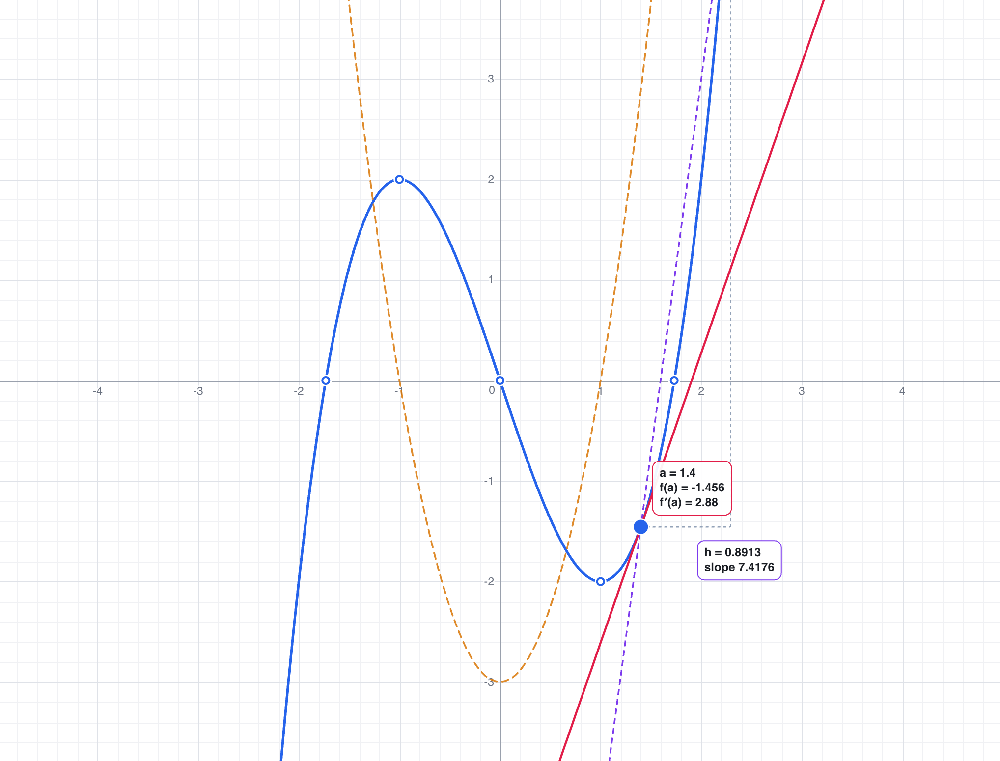
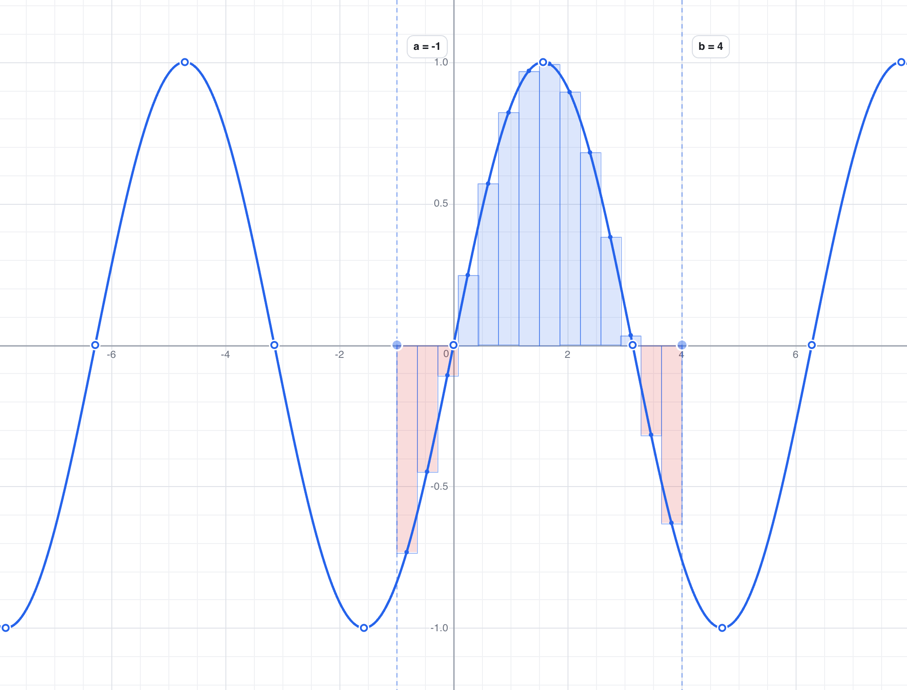

<div align="center">


**A graphing calculator that shows you how derivatives and integrals actually work.**

Built from scratch — its own expression parser, its own symbolic differentiation,
its own plotter. No libraries, no build step, no dependencies.

[**Try it →**](https://franciscomendez114.github.io/Graphia/)

</div>

---

## What it does

Graphia plots functions like any graphing calculator. What makes it different is
that it will also show you *why* the calculus works.

### The derivative, as a limit you can watch



Pick a point on the curve and drag it. Graphia draws the **tangent** there
(red), plots **f′(x)** across the whole domain (orange, dashed), and — with the
limit definition switched on — the **secant** through `(a, f(a))` and
`(a + h, f(a + h))` with its rise-and-run triangle (purple).

Then shrink `h`. The secant rotates into the tangent and the difference quotient
converges on `f′(a)`, with the numbers changing alongside the picture:

```
f′(a) = lim   f(a + h) − f(a)
        h→0   ───────────────
                     h
```

Derivatives are computed **symbolically** where the rules apply — `d/dx[x³ − 3x]`
comes back as `3x² − 3`, not as a numerical approximation. Where no rule applies
(`min`, `mod`, …), it falls back to a numeric limit so the tangent still works.

### The integral, as an approximation you can measure



Drag the interval handles and watch the **Riemann sum** rebuild. Four rules are
available — left endpoint, right endpoint, midpoint and trapezoid — and the dots
show you exactly where each rule takes its sample.

Area below the axis counts as negative (red), which is the part that trips people
up when a signed total comes out smaller than the shaded region looks.

The panel also shows the **exact** value, computed by adaptive Simpson
integration, and therefore the **error**:

| n | sum | error |
|--:|--:|--:|
| 2 | 0.85977 | −0.334 |
| 8 | 1.18034 | −0.0136 |
| 32 | 1.19310 | −0.000849 |
| 128 | 1.19392 | −5.31e-5 |

That error column is the point. It turns "a Riemann sum approximates the
integral" into something you can watch shrink as `n` grows.

## Everything else

- **Multiple functions** at once, each with its own colour, visibility toggle and
  inline error message.
- **Roots and turning points** marked automatically, found by bracketing the
  sampled curve and then refining with bisection and golden-section search.
- **Trace** — hover any curve to read exact coordinates.
- **Independent axis scaling**, so `y = 500x²` is as usable as `y = sin(x)`.
  Shift-scroll stretches x, ⌥-scroll stretches y.
- **Autosave** to the browser, plus a **share link** that carries the whole
  session in the URL.
- **PNG export** at twice screen resolution, for pasting a graph into homework.
- Light and dark themes, following the system by default.
- Works with a mouse, a trackpad, or touch (pinch to zoom).

## Writing functions

`x^2`, `y = x^2` and `f(x) = x^2` all mean the same thing.

| | |
|---|---|
| `2x`, `3sin(x)`, `(x+1)(x-1)` | implicit multiplication |
| `sin cos tan` · `asin acos atan` | and `sec csc cot`, `acot` |
| `sinh cosh tanh` | and `sech csch coth`, plus inverses |
| `ln(x)` `log(x)` `log2(x)` | natural, base 10, base 2 — also `logbase(b, x)` |
| `sqrt(x)` `cbrt(x)` `exp(x)` | `x^(1/3)` stays real for negative x |
| `abs(x)` or `\|x\|` | absolute value |
| `floor ceil round sign` | step functions |
| `min max mod atan2` | multi-argument |
| `pi` `e` `tau` `phi` | constants — `π`, `√`, `x²` paste in fine |

One convention worth stating: implicit multiplication binds exactly as tightly as
an explicit `*`, so `1/2x` reads as `(1/2)·x`.

## Running it

There is nothing to install and nothing to build. Any static file server will do:

```bash
python3 serve.py
```

Then open <http://localhost:8123>. (`serve.py` is a small wrapper around Python's
built-in server that disables caching, so edits show up on refresh.)

Opening `public/index.html` straight from the filesystem will *not* work — ES
modules require `http://`.

## Tests

Start the server, then open <http://localhost:8123/tests/>. 120 tests, no
framework, no build — they import the same modules the app does and run in the
browser.

The one worth pointing out is the symbolic-derivative property test. Rather than
checking a handful of hand-written expected values, it differentiates 44
expressions symbolically and compares the result against a Richardson-extrapolated
numeric derivative at several points in each domain. Hand-written differentiation
rules are exactly the sort of code where one transposed sign hides forever, and
this catches that.

## How it works

```
public/
  index.html            markup, including the tool panels
  css/style.css         all styling — and the canvas palette, see below
  src/
    math/
      parser.js         tokeniser + recursive-descent parser → AST
      ast.js            node constructors and helpers
      functions.js      the function registry: numeric impl + derivative rule
      compile.js        AST → a JavaScript closure
      derive.js         symbolic differentiation
      simplify.js       algebraic tidy-up, so output reads as algebra
      format.js         AST → text, with precedence-aware parentheses
      numeric.js        adaptive Simpson, bisection, golden section
      expression.js     the facade everything else uses
    graph/
      viewport.js       the camera: world ↔ screen, pan, zoom
      sampler.js        adaptive sampling  ← the interesting one
      ticks.js          1-2-5 tick selection and label formatting
      renderer.js       canvas drawing
    features/
      riemann.js        the four sum rules, plus convergence tables
      tangent.js        tangent and secant geometry
      keypoints.js      roots, turning points, nearest-curve search
    ui/                 the function list, tool panels, theme, dialogs
    state.js            state, autosave, URL sharing
    app.js              frame loop, input handling, overlay drawing
  tests/                the suite and a small runner
```

Two decisions are worth explaining.

**Colours are defined once, in CSS.** The canvas palette lives in
`css/style.css` as `--c-*` custom properties, and `renderer.js` reads them at
draw time. The graph and the interface therefore cannot disagree about what dark
mode means.

**Rendering is on demand.** A frame is produced only when something has actually
changed — there is no 60fps idle loop.

### The plotter

The first version of Graphia drew curves by stepping x in fixed increments of
0.0005 across the whole visible domain, storing every point in **screen**
coordinates, and drawing a filled circle at each one. On a wide view that came to
roughly 200,000 points per function, redrawn every frame and rebuilt from scratch
on every zoom.

The problem is structural: the cost was proportional to how much of the world was
on screen. Zooming out made it slower without making it any more accurate — the
extra points just landed on top of each other.

The rewrite inverts that. You only ever have `width` pixels to draw into, so:

1. **Sample once per pixel column** — about 1,300 samples, whatever the zoom.
2. **Subdivide only where the curve bends.** For each segment, check whether its
   midpoint sits more than a fifth of a pixel off the straight line between the
   endpoints; if it does, split and recurse. Straight stretches cost nothing;
   tight corners get the samples they need. A per-interval budget keeps a
   pathological function from eating the frame.
3. **Break the line at discontinuities.** A gap in the domain (`ln`, `sqrt`) is
   found by bisecting to the edge, so `sqrt(x)` ends exactly at the origin rather
   than a pixel to its right. A vertical asymptote (`tan`, `1/x`) is detected by
   checking that the divergence keeps growing as you approach it — which is what
   distinguishes a real pole from a merely very steep line — and the polyline is
   split there instead of drawn straight through.

Each curve is then a handful of polylines, stroked in a single canvas path.

The result, measured in the browser with ten functions plotted simultaneously:

| pixels per unit | sampling time | evaluations |
|--:|--:|--:|
| 0.0001 | 5.6 ms | 32,000 |
| 1 | 5.4 ms | 31,000 |
| 64 | 4.1 ms | 25,000 |
| 100,000 | 3.6 ms | 23,000 |
| 100,000,000 | 3.7 ms | 24,000 |

Twelve orders of magnitude of zoom, essentially flat cost — because the cost is
now tied to the number of pixels rather than the size of the world.

## About

Graphia began as my IB MYP Personal Project in 2023. The goal was to learn how a
graphing calculator works by building one, and then to add something calculators
usually leave out: a way to *see* what a derivative and an integral are, rather
than just being handed the answer.

This version keeps that idea and rebuilds the machinery underneath it — a real
expression parser, symbolic differentiation, and a plotter whose cost no longer
depends on the zoom level.

## Licence

[MIT](LICENSE) © Francisco Mendez
